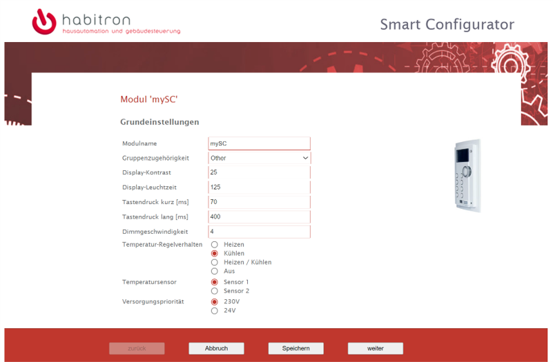

# Home Assistant Add-on: SmartHub

SmartHub for Habitron systems based on Raspberry Pi.

![Supports aarch64 Architecture][aarch64-shield]

## About

SmartHub performs as gateway between network clients, such as home assistant, and the serial interface of the Habitron router.

SmartHub also offers a web based configurator to setup names and basic settings of all Habitron modules.

[aarch64-shield]: https://img.shields.io/badge/aarch64-yes-green.svg
